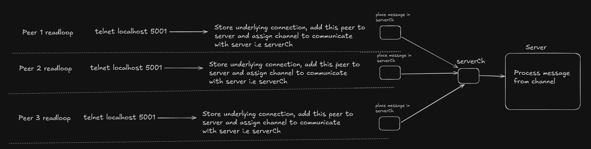

# Go Server-Peer Basic Setup

A minimal implementation of a TCP server with peer connection handling in Go. This project demonstrates the foundational structure for building more advanced peer-to-peer or client-server applications.

## Features

- TCP server with configurable listen address
- Basic peer connection management
- Message handling loop
- Concurrent connection handling
- Structured logging with `slog`

## Project Structure
├── main.go # Server implementation and main entry point
├── peer.go # Peer connection handling logic

## Code Overview

### Peer Implementation (`peer.go`)

The `Peer` struct represents a connected client/peer with:
- Network connection (`net.Conn`)
- Message channel for communication
- `readLoop()` method for continuous message reading

### Server Implementation (`main.go`)

The `Server` struct includes:
- Configuration management
- Peer tracking with a map
- Channel-based communication for:
  - New peer connections
  - Quit signals
  - Message passing
- Main server loop for handling messages and connections

